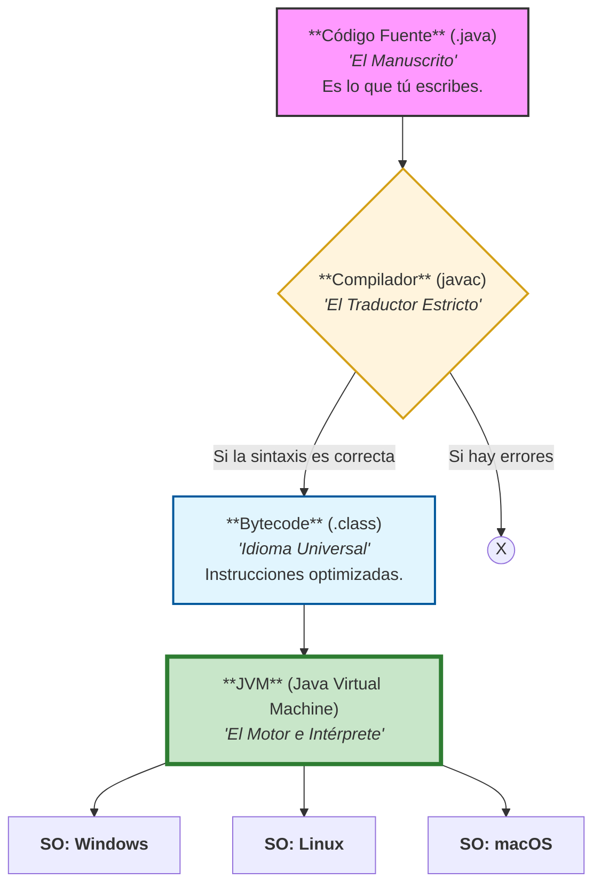
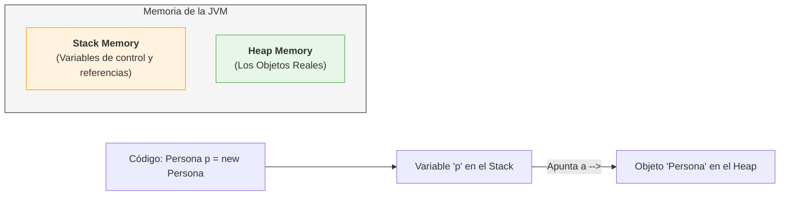
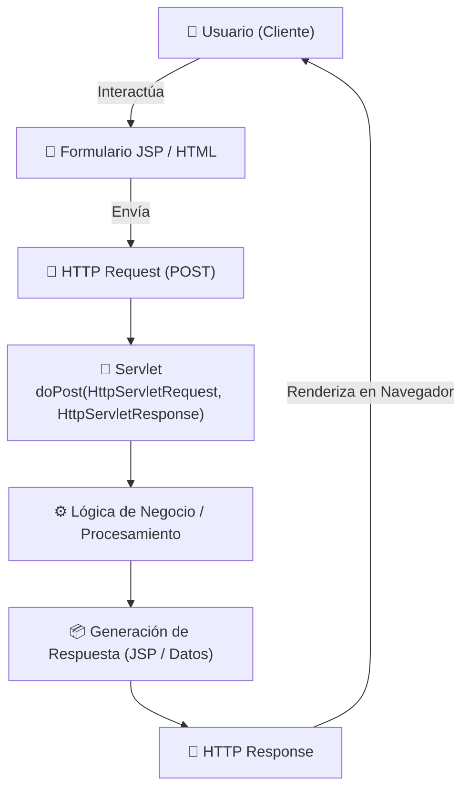

# JAVA - ☕

## 1. ¿Qué es Java?

Java es un lenguaje de alto nivel y una plataforma de ejecución. Es el estándar en la industria bancaria y Fintech debido a su robustez y seguridad.

Sus pilares fundamentales:
- **Fuertemente Tipado y Verboso**: Java prioriza la claridad sobre la brevedad. Cada dato tiene un tipo definido ```int balance```, lo que evita errores accidentales. **"Verbozo"** significa que el código se explica solo: es mejor ```int accountBalance``` que un ```int b```.

- **Orientado a Objetos (POO)**: Organiza el código imitando conceptos del mundo real (Clientes, Cuentas, Transacciones), permitiendo crear sistemas complejos y abstractos (ocultando la complejidad técnica del usuario).

- **Abstracción (El Enfoque)**: Java nos permite enfocarnos en "qué hace" un objeto en lugar de "cómo lo hace". Es la capacidad de simplificar problemas complejos del mundo real (como un sistema bancario) en modelos manejables. Sin abstracción, el código sería un caos de detalles técnicos imposibles de mantener.

- **Multihilos (Multithreading)**: Capacidad nativa para realizar tareas en paralelo. Fundamental para que un servidor procese miles de pagos simultáneos sin colapsar.

- **Independiente del Hardware**: Gracias a su lema: "Write once, run anywhere" (Escríbelo una vez, ejecútalo en cualquier lugar).

## 2. El Ecosistema: ¿Qué instalar?
Para trabajar en Java, debes conocer la diferencia entre estas herramientas:

| Siglas | Nombre | ¿Para qué sirve? |
|--------|--------|------------------|
| **JDK** | Java Delopment Kit | **Caja de herramientas del programador**. Contiene el compilador (javac). |
| **JRE** | Java Runtime Eviroment | **Caja para el usuario**. Solo sirve ejecutar programas ya hechos |
| **JVM** | Java Virtual Machine | **El motor**, Traduce el código universal al lenguaje de tu pc |

## 3. ¿Cómo funciona Java??
Java no corre directament en tu procesador; corre una simulación segura llamada JVM.


| Código Fuente | Compilador | Bytecode | JVM |
|---------------|------------|----------|-----|
| ```.java``` | ```javac``` | ```.class``` | Java Virtual Machine|
|El Manuscrito | El traductor estricto | Idioma Universal | El intérprete y Motor |
| Es lo que tu esribes | El compilador toma tu archivo ```.java``` y lo revisa de arriba a abajo para validar que toda la sintaxis sea correcta. Si todo está bien, crea un archivo ```.class``` que contiene **Bytecode**.|Es el lenguaje intermedio. No es código máquina, sino un conjunto de instrucciones optimizadas que solo la JVM entiende. | El "simulador" que traduce el Bytecode a lenguaje real de tu procesador (Windows, Mac, Linux). |





## 4. Programación Orientada a Objetos (POO)

Java nos obliga a pensar en Moldes y Productos.

### 4.1 El concepto de Clase (`Class`) - El Molde

Una `Clase` es la unidad básica en Java. Como vimos en la definición, Java es **Verboso** y **Abstracto**; por lo tanto, no puedes simplemente escribir código "al aire". Todo debe pertencer a una clase que define los **atributos** (datos) y **comportamientos** (métodos) que tendrá un objeto.

### 4.2 El concepto de Objeto - La Instancia
El **Objeto** es el producto real creado a partir del modelo. Aquí es donde entra la JVM 

## El corazón de la ejecución: Stack vs. Heap
Cuanto tu programa Java corre, la JVM reserva memoria de 2 formas distintas. el **Stack** es para tareas rápidas y **Heap** es para alamcenar productos gigantes.

| Característica | **Stack** (La Pila) | **Heap** (El Monton) |
|----------------|---------------------|----------------------|
| **¿Qué guarda?** | Variables locales y llamadas a métodos. | **Objetos** y variables de instancia. |
| **Orden** | LIFO (Last In First Out). Muy Organizado. | Desordenado. Los objetos se guardan donde haya espacio. |
| **Ciclo de Vida** | Vive solo mientras el método se ejecuta. | Vive mientras alguien lo esté usando |
| **Velocidad** | Extremadamente rápido | Más lento (requiere más gestión) |

### JVM MEMORIA


### ¿Cómo interactuan?
Aquí es donde tu concepto de **"Molde y Producto"** se conecta con la memoria:

1. **La referencia (En el Stack)**: Cuando escribes ```Person person1```, estas creando un pequeño espacio en el **Stack** llamado ```person1```. Es como tener la dirección de un casa anotada en un papel.

2. **El Objeto (En el Heap)**: Cuando escribes ```new Person()```, la JVM busca espacio en el **Heap** y construye el objeto real (el producto).

3. **El Vínculo**: El Stack guarda la "dirección" que apunta hacia el objeto en el Heap.

## El recolector de basura (Garbage Collector)
Java tiene gestión automática de memoria. Esto sucede gracias al **Garbage Collector (GC)**, un proceso que vive en el **Heap**.

- **¿Qué hace?** Escanea el Heap buscando objetos que ya nadie usa (objetos a los que el Stack ya no apunta).

- **¿Por qué es importante?** En lenguajes antiguos como C++, tú tenías que limpiar la memoria manualmente. Si se te olvidaba, tu programa "explotaba". En Java, el GC pasa la escoba por ti, permitiéndote enfocarte en la lógica de negocio.


## L.1 ¿Qué es un **Servlet**??
- Es una "Clase" especial de **Java** que se utiliza como punto intermedio entre una página **JSP** y el **servidor web** donde está alojada la lógica de una aplicación

- Un **servlet** se encaga de recibir **peticiones o request** desde un *cliente*, tratarlas y analizar si es necesario realizar anula solicitud en particular o brindar una determinada **respuesta o response**.

- Para poder tratar cada una dwe las peticiones utiliza una serie de mpetodos donde dependiendo del verbo por el cual ser reciba la petición (GET, POST, PUT, DELETE, etc)

### Métods de un servelete
Los ***servelets** tienen diferentes métidos que puede ser utilizado dependiento del tipo de solicitud que reciban por parte del cliente. Los dos más usado son:

- **doGet()**: Es el método encargado de recibir las solicitudes que provienen mediante GET.

- **doPost()**: Es el método encargado de recibir solicitudes que provienne mendaiante el POST.



### Pasar datos a un Servlet con getParameter()
El metodo **getParametr()** es una función importante en los **servlets** de **Java** que se utiliza para enviar datos desde un formulario HTML o para recuperar los parámetros de una solicitud HTTP GET en un servlet.

Estee método permite que los servlets accedan a la información proporcionada por el cliente a través de una solicitud HTTP

```java
String name = request.getParameter("txtNombre");
```

> El método ```getParameter()``` siempre devuelve un ```String```