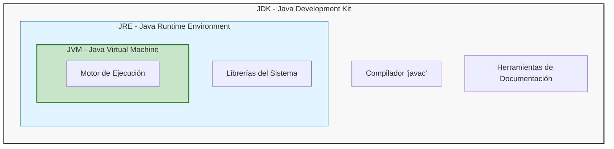
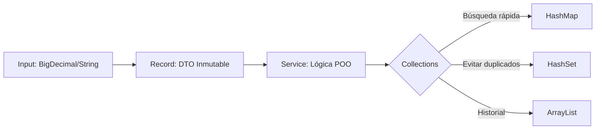
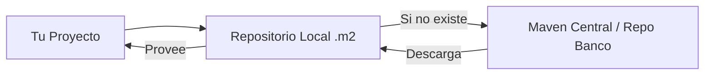
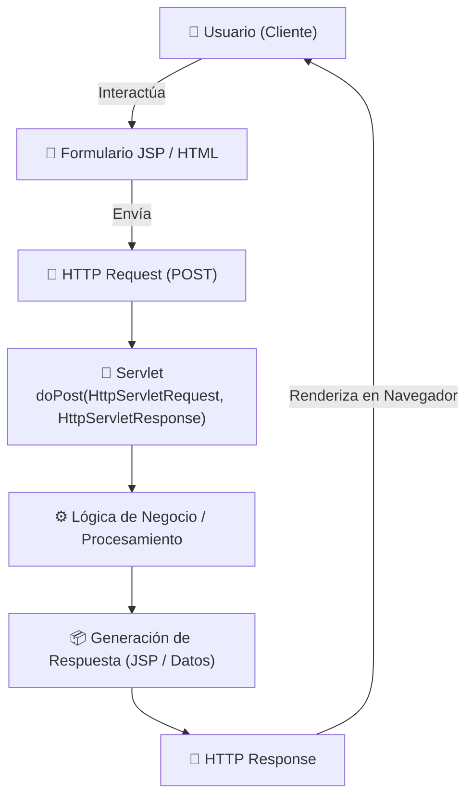
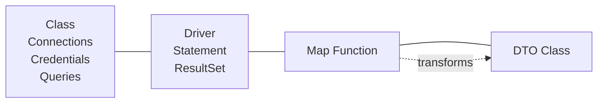
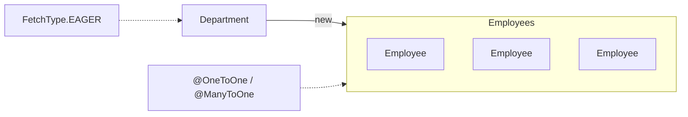
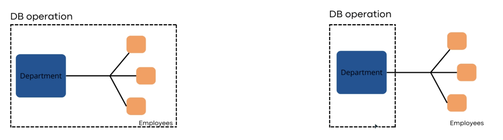

# JAVA - ☕
- **[Módulo I: Entorno de Ejecución](##módulo-i-entorno-de-ejecución)**
    1. [¿Qué es Java?](#1-qué-es-java)
    2. [Ecosistema (JDK, JRE, JVM)](#2-ecosistema-jdk-jre-jvm)
    3. [Sandbox y Flujo de Ejecución](#3-sandbox-y-flujo-de-ejecución)

- **[Módulo II: Gestión de Memoria y Datos](#módulo-ii-gestión-de-memoria-y-datos)**
    4. [Memoria (Stack, Heap y Garbage Collector)](#4-memoria-stack-heap-y-garbage-collector)
    5. [Tipos de Datos (Primitivos, Wrappers y BigDecimal)](#5-tipos-de-datos-primitivos-wrappers-y-bigdecimal)
    6. [Inmutabilidad y String Pool](#6-inmutabilidad-y-string-pool)
    7. [Java Records (DTOs Modernos)](#7-java-records-dtos-modernos)
    8. [Java Time API](#8-java-time-api)
    9. [Contrato de Identidad (Equals y HashCode)](#9-contrato-de-identidad-equals-y-hashcode)

- **[Módulo III: POO Avanzada](#módulo-iii-poo-avanzada)**
    10. [Anatomía de Métodos y Modificadores de Acceso](#10-anatomía-de-métodos-y-modificadores-de-acceso)
    11. [Los 4 Pilares de la POO](#11-los-4-pilares-de-la-poo)
    12. [Interfaces vs Clases Abstractas](#12-interfaces-vs-clases-abstractas)
    13. [Enums con Comportamiento](#13-enums-con-comportamiento)

- **[Módulo IV: Estructuras de Datos y Lógica](#módulo-iv-estructuras-de-datos-y-lógica)**
    14. [Arrays (La Base)](#14-arrays-la-base)
    15. [Generics (Seguridad de Tipado)](#15-generics-seguridad-de-tipado)
    16. [Collections Framework (List, Set, Map)](#16-collections-framework-list-set-map)
    17. [Optional (Adiós al Null)](#17-optional-adiós-al-null)
    18. [Stream API (Procesamiento Fluido)](#18-stream-api-procesamiento-fluido)

- **[Módulo V: Resiliencia y Herramientas](#módulo-v-resiliencia-y-herramientas)**
    19. [Gestión de Excepciones (Checked vs Unchecked)](#19-gestión-de-excepciones-checked-vs-unchecked)
    20. [Anotaciones (Metadata)](#20-anotaciones-metadata)
    21. [Apache Maven (Gestión Industrial)](#21-apache-maven-gestión-industrial)
## Módulo I: EL entorno de Ejecución

### 1. ¿Qué es Java realmente?

Java es un lenguaje de **alto nivel** y una **plataforma de ejecución**. Es el estándar en la industria bancaria y Fintech debido a su **robustez** y **seguridad** No solo escribes código, construyes sistemas que corren en un entorno controlado.

Sus pilares fundamentales:
- **Fuertemente Tipado**: Java prioriza la claridad sobre la brevedad. Cada dato tiene un tipo definido `int balance`, Esto evita errores de desbordamiento o tipos incompatibles en cálculos críticos.

- **"Verboso"** significa que el código se explica solo: es mejor `int accountBalance` que un `int b`.

- **Orientado a Objetos (POO)**: Organiza el código imitando conceptos del mundo real (Clientes, Cuentas, Transacciones), permitiendo crear sistemas complejos mediante modelos manejables.

- **Abstracción (El Enfoque)**: Java nos permite enfocarnos en "qué hace" un objeto en lugar de "cómo lo hace". Es la capacidad de simplificar problemas complejos del mundo real en modelos.

- **Multihilos (Multithreading)**: Capacidad nativa para realizar tareas en paralelo. Fundamental para que un servidor procese miles de pagos simultáneos sin colapsar.

- **Independiente del Hardware**: Gracias a su lema: *"Write once, run anywhere"* (Escríbelo una vez, ejecútalo en cualquier lugar). El código que haces en tu laptop funcionará exactamente igual en el servidor gigante del banco.

### 2. El Ecosistema: ¿Qué instalar?
Para trabajar en Java, debes conocer la diferencia entre estas herramientas:

| Siglas | Nombre | ¿Para qué sirve? |
|--------|--------|------------------|
| **JDK** | Java Delopment Kit | **Caja de herramientas**. Contiene el compilador (`javac`), herramientas de documentación y el JRE. Es lo que instala el programador |
| **JRE** | Java Runtime Eviroment | **Entorno de Ejecución**. Es el paquete mínimo necesario para que un usuario final pueda correr una aplicación Java. |
| **JVM** | Java Virtual Machine | **El motor de la ejecución**. Traduce el código universal (Bytecode) a instrucciones que el procesador de la computadora (Intel, Apple, AMD) entiende. |

### Diagrama de Jerarquía del Ecosistema
Este diagrama muestra cómo el JDK contiene al JRE, y este a su vez protege al motor (JVM).



### 3. Flujo de Ejecución y Seguridad - Sandbox
Java no corre directamente sobre el hardware. Se ejecuta dentro de una **JVM**, lo que crea un entorno seguro o **Sandbox**, protegiendo al sistema operativo de código malicioso o errores graves.


| Fase | Componente | Resultado | Descripción |
|------|------------|-----------|-------------|
| **Escritura** | Código Fuente  | `.java` | El archivo de texto con lógica humana. |
| **Compilación** | `.javac`  | `.class` | El "Traductor Estricto" genera Bytecode (instrucciones optimizadas). |
| **Interpretación** | **JVM** | Ejecución | El motor traduce el Bytecode a lenguaje máquina en tiempo real. |


## Módulo II - Gestión de Memoria y Datos
### 4. Gestión de Memoria: Stack vs. Heap
Entender la memoria es la diferencia entre un programa eficiente y uno que colapsa un servidor bancario

- **Stack (Pila)**: Tareas Rápidas
  - **Función**: Memoria de acceso ultra rápido y corto plazo.

  - **Qué guarda**: Variables locales (primitivos como int, double) y las referencias (direcciones) a los objetos.

  - **Orden**: LIFO (Last In, First Out). Cuando un método termina, su Stack se limpia instantáneamente

- **Heap (Monton)**: El Gran almacén
  - **Función**: Memoria de largo plazo y gran capacidad.

  - **Qué guarda**: Los Objetos Reales (instancias de clases).

  - **Gestión**: Aquí vive el Garbage Collector (GC), que limpia automáticamente los objetos que ya no tienen una referencia en el Stack.

#### 4.1 ¿Cómo interactúan?
Este es el concepto clave:

1. **La referencia (En el Stack)**: Cuando escribes `Person person1`, estas creando un pequeño espacio en el **Stack** llamado `person1`. Es la "etiqueta" o el control remoto. Es como tener la dirección de un casa anotada en un papel.

2. **El Objeto (En el Heap)**: Al escribir `new Person()`, la JVM busca espacio en el Heap y construye el objeto físico.
    >⚠️ Ojo: Si el dato es un **Primitivo** (como `int age = 10`), el valor se guarda directamente en el Stack, ocupando el mínimo espacio y siendo ultra rápido.

3. **El Vínculo**: El control remoto en tu mano (Stack) apunta al televisor que está en la sala (Heap). ¡Si pierdes el control remoto, el televisor sigue ahí, pero ya no puedes usarlo!

#### 4.2. El recolector de basura (Garbage Collector)
Java tiene gestión automática de memoria. Esto sucede gracias al **Garbage Collector (GC)**, un proceso que vive en el **Heap**.

- **¿Qué hace?** Escanea el Heap buscando objetos que ya nadie usa (objetos a los que el Stack ya no apunta, es decir, objetos que perdieron su "control remoto").

- **¿Por qué es importante?** En lenguajes antiguos como C++, tú tenías que limpiar la memoria manualmente. Si se te olvidaba, tu programa "explotaba". En Java, el Garbage Collector pasa la escoba por ti.


### 5. Tipos de Datos y la Regla de Oro Financiera
En Java, la elección del tipo de dato determina no solo qué valor guardas, sino **dónde** se guarda y **cómo** se comporta el sistema al procesarlo.

#### 5.1 Tipos Primitivos (Viven en el Stack)
Son los bloques de construcción básicos. No son objetos, son valores crudos.

- **Eficiencia**: Al vivir en el **Stack**, su acceso es casi instantáneo.
- **Limitación**: No pueden ser `null`. Siempre tienen un valor (0 para números, `false` para booleanos).
- **Tipos clave**:

- `int`: Enteros de 32 bits (IDs, contadores).
- `long`: Enteros de 64 bits (IDs grandes, timestamps).
- `boolean`: Valores lógicos (`true/false`).

#### 5.2 Clases Wrapper (Objetos en el Heap)
Para cada primitivo, Java ofrece una "clase envoltorio" (`Integer`, `Long`, `Boolean`, `Double`).

- **Por qué existen**: Java es un lenguaje orientado a objetos. Muchas herramientas del lenguaje (como las Colecciones) **solo aceptan objetos**, no primitivos.

- **Capacidad Null**: A diferencia de los primitivos, estos pueden ser `null`. Esto es vital para representar "ausencia de dato" en un sistema real.

- **Costo**: Al ser objetos, viven en el **Heap** y requieren más memoria y tiempo de procesamiento (un proceso llamado *Autoboxing*).

#### 5.3 La Precisión Decimal: El problema del `Double`
En computación, los tipos `float` y `double` siguen el estándar IEEE 754 (base 2). Esto es excelente para ciencia o gráficos, pero desastroso para contabilidad.

- El Error: No todos los números decimales se pueden representar de forma exacta en binario.
    `0.1 + 0.2` en Java no es `0.3`, es `0.30000000000000004`.

- **La Solución**: `BigDecimal`: Es una clase diseñada para cálculos de precisión arbitraria.

    - **Precisión**: Tú controlas cuántos decimales quieres y cómo redondear.

    - **Inmutabilidad**: Al igual que un `String`, un `BigDecimal` no cambia. Si sumas dos montos, obtienes un nuevo objeto con el resultado.

    > Tip: "Nunca uses `new BigDecimal(double)`. Usa siempre `new BigDecimal(String)` o `BigDecimal.valueOf(double)` para evitar heredar la imprecisión del tipo double desde el inicio."

### 6. La Inmutabilidad y el String Pool
En un sistema transaccional, la inmutabilidad no es un lujo, es una estrategia de seguridad. Un objeto **inmutable** es aquel cuyo estado no puede cambiar después de ser creado.

#### 6.1 ¿Por qué es vital en sistemas críticos?

1. **Thread-Safety (Seguridad en hilos)**: Si un objeto no cambia, puede ser compartido por miles de hilos (pagos simultáneos) sin riesgo de que uno corrompa el dato del otro. No necesita "locks" o bloqueos complejos.

2. **Consistencia**: Si pasas un objeto `Amount` a un método de validación, tienes la certeza de que el método no alterará el valor original por accidente.

#### 6.2 El String Pool (La optimización del Heap)
La clase `String` es el objeto más usado en Java. Para ahorrar memoria, Java no crea un objeto nuevo cada vez si el texto es el mismo; usa el **String Pool**.

- **¿Qué es?** Una zona especial dentro del Heap donde se almacenan cadenas de texto únicas.

- **¿Cómo funciona?** Cuando escribes `String account = "ES123"`, la JVM busca en el Pool. Si ya existe, te da la referencia existente.

- La trampa del `new`: Si usas `String text = new String("ES123")`, obligas a Java a crear un objeto fuera del Pool, desperdiciando memoria.

    > ⚠️ Lección de Arquitectura: El String Pool solo funciona porque los Strings son inmutables. Si pudieras cambiar un String, cambiarías el valor para todas las partes del programa que apuntan a esa referencia en el Pool, causando un desastre sistémico.

### 7. Java Records (El estándar para DTOs)
Para evitar escribir cientos de líneas de código repetitivo (Getters, Setters, Equals, HashCode), Java introdujo los **Records**.

```java
public record Transaction(Long id, BigDecimal amount, String currency) {}
```

Un Record es, por defecto:
- **Inmutable**: Sus campos no pueden cambiar una vez creados.

- **Compacto**: Java genera automáticamente el constructor, los métodos de acceso, `equals`, `hashCode` y `toString`.

- **Ideal para DTOs**: Es la forma perfecta de mover datos entre capas del sistema con total seguridad.

### 8. Java Time API (`java.time`)
Históricamente, manejar fechas en Java era un caos (`java.util.Date` era mutable y confuso). Desde Java 8 (y estándar en Java 17), usamos una API basada en la inmutabilidad y la claridad.

| Clase | Uso Principal |
|-------|---------------|
| `LocalDate` | Fechas sin hora (ej. un día de pago, un cumpleaños). |
| `LocalTime` | Horas sin fecha (ej. hora de cierre). |
| `LocalDateTime` | Fecha y hora, pero "huérfana" de contexto geográfico. |
| `Instant` | Un punto único en el tiempo (UTC). Es la "huella digital" de cuándo ocurrió algo. |
| `ZonedDateTime` | Fecha y hora con una zona horaria específica (ej. `America/New_York`). |

- Inmutabilidad: Todas estas clases son inmutables. Si le sumas un día a una fecha, la fecha original no cambia; recibes una nueva instancia. Esto evita errores en sistemas multihilo.

#### 8.1 El error del "Servidor Local"
Nunca uses `LocalDateTime` para guardar transacciones. Si tu servidor está en Nueva York y tu base de datos en Londres, el "ahora" será distinto.

- **Solución**: Trabaja siempre con `Instant` (UTC) en la lógica de negocio y solo convierte a zona horaria local en la capa de presentación (la UI del usuario).

### 9. El Contrato de Identidad: `equals()` y `hashCode()`
Este es quizás el concepto más importante de Java para asegurar la integridad de los datos.

En Java, el operador `==` compara referencias (si son el mismo objeto en memoria), no el contenido. Para comparar el "alma" o los datos de un objeto, usamos estos dos métodos:

1. `equals(Object o)`: Es el método que usamos para decir: "Estos dos objetos son iguales porque sus valores (ID, código, etc.) coinciden", aunque estén en lugares distintos de la memoria.

2. `hashCode()`: Es una función que traduce el contenido del objeto en un número entero.

#### 9.1 La Regla de Oro (El Contrato):

> Si dos objetos son iguales según el método `equals()`, obligatoriamente deben devolver el mismo número en el método `hashCode()`.

#### ¿Por qué es vital?
Si rompes este contrato, las estructuras de datos como los `HashMap` o `HashSet` dejarán de funcionar. Podrías intentar buscar un cliente en una lista y Java te diría que "no existe" simplemente porque su `hashCode` es distinto, aunque sus datos sean idénticos.

## Modulo III - Orientación a Objetos Avanzada (El Contrato)
En Java, una clase no es solo un "molde", es un perímetro de seguridad. El acceso a los datos debe ser restrictivo por defecto.

### 10. Anatomía de una Clase y Modificadores
Antes de crear lógica bancaria, debemos entender cómo se estructura un método y quién tiene permiso de entrar a él. Un método es una acción que el objeto puede realizar.

#### 10.1 Estructura de un método:
Un método en un sistema crítico debe ser predecible:
`[Modificador de Acceso] [Modificador de Estado] [Tipo de Retorno] [Nombre]([Parámetros])`

- **Tipo de Retorno**: Siempre prefiere objetos o Wrappers (`Long`, `BigDecimal`) sobre primitivos si el resultado puede ser opcional o nulo.

- **Parámetros**: La información que el método necesita para trabajar (ej. `double price`). Y deben ser lo más específicos posible para evitar errores de tipo.

#### 10.2 Los 4 Modificadores de Acceso
En banca, el acceso a los datos es crítico. Java usa estos niveles para decidir quién ve qué, debes ver los modificadores como capas de una cebolla que protegen el núcleo (los datos):

| Modificador | Clase | Paquete | Subclase (Heredero) | Mundo (Externo) | Uso en Banca |
|-------------|-------|--------|-------------|--------------|------------|
| `public` | Sí | Sí | Sí | Sí | Para servicios que cualquiera puede usar (ej. `consultarTipoDeCambio`) |
| `protected` | Sí | Sí | Sí | No | **Vital para JPA**. Permite que clases hijas usen el dato, pero nadie más de fuera. |
| `default` (No se escribe) | Sí | Sí | No | No | Llamado *Package-Private*. Solo los que están en la misma "oficina" (paquete) lo ven. |
| `private` | Sí | No | No | No | **Regla de oro**. Los saldos y claves siempre deben ser privados. |


### 11 Los 4 Pilares de la POO (Programación Orientada a Objetos)
Si la Clase es el molde y el Objeto es el producto, estos pilares son las reglas de ingeniería para que tu software sea profesional y seguro.

1. **Encapsulamiento**: Proteger los datos sensibles. Los atributos se marcan como `private` y se accede a ellos mediante métodos `public` (Getters/Setters) que validan la información.

2. **Abstracción**: Simplificar la realidad. Definimos qué hace un sistema (ej. `procesarPago()`) sin obligar al usuario a entender la complejidad interna. **En Java**: Ocultamos la complejidad interna y solo exponemos métodos que representen acciones de negocio claras.

3. **Herencia**: Reutilizar lógica. Una `CuentaAhorro` hereda las propiedades de una `CuentaBancaria`.

4. **Polimorfismo**: Un mismo comando, distintos comportamientos. El método `calcularComision()` actuará diferente si el objeto es una "Cuenta VIP" o una "Cuenta Estándar".

### 12. Interfaces vs. Clases Abstractas: El Contrato Bancario
En el nivel experto, no solo heredas código, sino que firmas **contratos de comportamiento**.

#### 12.1 La Clase Abstracta (`abstract class`)
Es un "híbrido". Es un molde que no puede ser un producto final (no puedes hacer `new` de ella), pero tiene partes ya construidas.

- **Cuándo usarla**: Cuando tienes una base común. Ejemplo: Una `AccountBank` genérica tiene la lógica de "ver saldo", pero el "cobrar comisión" es diferente para cada una.

- En JPA: Se usan para crear "Entidades Base" que tienen campos comunes como `id` o `fecha_creacion`.

#### 12.2 La Interfaz (`interface`)
Es un contrato puro. No dice cómo se hacen las cosas, solo qué cosas se deben poder hacer.

En Fintech: Son fundamentales. Definimos una interfaz `PaymentProcessor`. Luego, podemos tener una implementación para `Visa` y otra para `Stripe`. El sistema principal no sabe cuál usa, solo sabe que ambas cumplen el contrato.

| Característica | Clase Abstracta | Interfaz |
|----------------|-----------------|----------|
| **Herencia** | Una clase solo puede heredar de UNA. | Una clase puede implementar MUCHAS interfaces. |
| **Atributos** | Puede tener variables normales (estado). | Solo constantes (`public static final`). |
| **Métodos** | Puede tener métodos con código y sin código. | Principalmente métodos sin código (hasta Java 8). |

### 13. Enums: Tipado fuerte para Estados de Negocio
En sistemas antiguos, los estados se manejaban con números (`1`, `2`, `3`) o texto (`"PENDIENTE"`, `"APROBADO"`). Esto es peligroso: un error de dedo (`"PENDIENE"`) puede detener un proceso financiero.

En Java moderno, los **Enums** son clases especiales que representan un grupo de constantes, pero con **comportamiento**.

- **Seguridad**: El compilador garantiza que solo uses los valores permitidos.
- **Estado y Comportamiento**: Un Enum en Java puede tener atributos y métodos.

```java
public enum TransactionStatus {
    PENDING(true),
    APPROVED(false),
    REJECTED(false);

    private final boolean canBeCanceled;

    TransactionStatus(boolean canBeCanceled) {
        this.canBeCanceled = canBeCanceled;
    }

    public boolean canBeCanceled() {
        return canBeCanceled;
    }
}
```

> Uso en Banca: Los Enums son el estándar para manejar tipos de moneda (USD, EUR), tipos de cuenta (SAVINGS, CHECKING) y ciclos de vida de una operació

### Modulo IV - Estructuras de Datos y Lógica

### 14. Generics: El "Contenedor Etiquetado"
Los Genéricos permiten que las clases, interfaces y métodos operen sobre tipos de datos específicos sin perder la seguridad del tipado fuerte.

- El Problema (**Pre-Java 5**): Se usaba la clase `Object`. Esto obligaba a realizar un Casting manual al recuperar datos. Si el programador se equivocaba de tipo, el sistema lanzaba una `ClassCastException` en producción (tiempo de ejecución).

- La Solución: Los Genéricos trasladan el error al **tiempo de compilación**. Si intentas meter un `String` en una lista de `List<CreditCard>`, el código ni siquiera compilará.

> 💡 Regla de Arquitecto: Los genéricos desaparecen en tiempo de ejecución (proceso llamado Type Erasure), por lo que su mayor beneficio es darte seguridad mientras escribes el código.

#### 14.1 Anatomía de un Genérico
Verás letras como `<T>`, `<E>` o `<K, V>`. No es código secreto, son "Placeholders" (espacios reservados).

- `<T>`: Significa Type (Tipo). Se usa cuando una clase puede manejar cualquier tipo.
- `<E>`: Significa Element (Elemento). Muy usado en listas.
- `<K, V>`: Key (Llave) y Value (Valor). Se usa en los Mapas.

### 15. Java Collections Frameworks
Cuando los Arrays se quedan cortos por su tamaño fijo, usamos Colecciones: contenedores dinámicos que crecen según la necesidad.

#### 15.1 `List` (ArrayList): El Registro Secuencial
Es una lista ordenada que permite duplicados.

- **Uso**: Cuando el orden de inserción importa (ej. el historial de movimientos de una cuenta).

- **Rendimiento**: Muy rápida para leer datos por índice, pero lenta para insertar elementos en el medio de una lista gigante.

#### 15.2 `Set` (HashSet): La Garantía de Unicidad
Colección que **no permite duplicados**.

- **La Clave**: Aquí es donde el **Contrato de** `equals()` y `hashCode()` cobra vida. Si intentas agregar dos objetos con el mismo ID, el `Set` usará esos métodos para detectar el duplicado y lo rechazará.

- **Uso**: Listas de IDs únicos, códigos de moneda soportados, o roles de usuario.

#### 15.3 `Map` (HashMap): El Buscador de Alto Rendimiento
Almacena pares **Llave : Valor**.

- **Uso**: Es el estándar para diccionarios de datos. Ejemplo: Buscar un objeto `Account` usando su `String accountNumber` como llave.

- **Velocidad**: Es la estructura más rápida para búsquedas directas (O(1)).



### 16. `Optional<T>`: El fin del NullPointerException
El creador de las referencias nulas llamó al `null` su "error del billón de dólares". En sistemas financieros, un `null` inesperado puede detener una dispersión de nómina.

`Optional` es un contenedor que puede o no tener un valor.

- **Enfoque**: Obliga al programador a pensar: "¿Qué pasa si este dato no existe?".

` **Mal uso**: No lo uses en atributos de clase o parámetros de métodos.

- **Buen uso**: Úsalo como tipo de retorno en métodos de búsqueda (ej. `public Optional<Account> findById(String id)`).

### 17. Stream API: Procesamiento Declarativo
Los Streams permiten procesar colecciones de datos de forma fluida, similar a una consulta SQL, pero en Java.

**Ejemplo Fintech**: Sumar todos los saldos mayores a 1000 USD.

```java
BigDecimal total = accounts.stream()
    .filter(acc -> acc.getBalance().compareTo(new BigDecimal("1000")) > 0)
    .map(Account::getBalance)
    .reduce(BigDecimal.ZERO, BigDecimal::add);
```

- `filter`: Descarta lo que no sirve.
- `map`: Transforma el objeto (de Cuenta a Saldo).
- `reduce`: Acumula el resultado (Suma).

## Módulo IV: Estructuras de Datos y Lógica

### 18. Arrays: La Primera Estructura de Datos
Antes de usar `List` o `Set`, debemos entender el **Array**. Es la estructura de datos más básica y cercana al hardware en Java.

- **Definición**: Una colección de elementos del mismo tipo almacenados en memoria de forma **contigua**.

- **Características Clave**:

    1. **Tamaño Fijo**: Una vez creado, no puede crecer ni encogerse.
    2. **Acceso O(1)**: Si conoces el índice, acceder al dato es instantáneo.

- **¿Por qué seguimos usándolos?** Las colecciones modernas (como `ArrayList`) usan un Array internamente. Los Arrays son más eficientes en uso de memoria y velocidad bruta, pero carecen de la flexibilidad de las Colecciones.

> 💡 **Regla de Oro**: Usa Arrays solo cuando conozcas el tamaño exacto de antemano (ej. los meses del año o los días de la semana) y necesites el máximo rendimiento. Para todo lo demás, usa el **Collections Framework**.

## Módulo V: Resiliencia y Herramientas
Ahora que hemos reubicado los cimientos, procedemos con el último módulo. Estos son los puntos que redactaremos a continuación:

1. **Gestión de Excepciones**: La anatomía del error. Diferencia crítica entre Checked y Unchecked en procesos financieros.

2. **Anotaciones (@Metadata)**: Cómo Java "lee" instrucciones sobre el código (el puente hacia JPA y Spring).

3. **Apache Maven**: El estándar industrial para construir, empaquetar y gestionar dependencias.

### 19. Gestión de Excepciones: Resilencia ante el Fallo
En Java, una **Excepción** es un evento inesperado que ocurre durante la ejecución de un programa y que interrumpe el flujo normal de las instrucciones.

#### 19.1 La Jerarquía del Error
- `Error`: Fallos catastróficos de la JVM (ej. `OutOfMemoryError`). No intentes atraparlos, el sistema debe morir.

- `Exception`: Fallos de la aplicación que debes gestionar. Se dividen en:

    - Checked (Verificadas): Obligatorias de manejar (ej. `SQLException`). El compilador te obliga a usar `try-catch` porque son fallos externos probables.

    - **Unchecked (RuntimeException)**: Errores de lógica (ej. `NullPointerException`). No es obligatorio atraparlas, sino evitarlas con buen código.

#### 19.2 La Anatomía del Try-Catch-Finally
Java nos da una estructura para "atrapar" estos errores antes de que maten al programa.

```java
try {
    // Código que puede fallar (ej. conectar al Core Bancario)
} catch (SpecificException e) {
    // Plan de contingencia: Loguear error y notificar
} finally {
    // SE EJECUTA SIEMPRE. Ideal para cerrar conexiones o liberar archivos.
}
```

#### 19.3 La Jerarquía: No todos los errores son iguales
Para ser un profesional, debes saber que Java organiza los errores en una familia:

- `Error`: Son fallos catastróficos de la **JVM** (ej. se acabó la memoria RAM del servidor). **No puedes atraparlos**; si esto pasa, el programa muere.
- `Exception`: **Estos son los que tú debes manejar**. Se dividen en dos:

##### Tabla: Checked vs. Unchecked Exceptions

| Tipo | Nombre | ¿Cuándo ocurre? | ¿Es obligatorio manejarla? | Ejemplo |
|------|--------|-----------------|----------------------------|---------|
| **Checked** | Verificadas | Errores externos (Bases de datos, Archivos). | **SÍ**. El compilador no te deja avanzar si no pones un `try-catch`. | `SQLException, IOException` |
| **Unchecked** | No verificadas | Errores de lógica del programador. | **NO**. Pero deberías evitarlas con buena lógica. | `NullPointerException, ArithmeticException` |

##### Propagación de Errores: El `throws`
A veces, un método no quiere hacerse cargo del error y prefiere "pasarle la bola" al que lo llamó. Esto se hace con la palabra clave `throws`.

### 20. Anotaciones (@Metadata): Etiquetas Inteligentes
Las anotaciones son etiquetas que pegamos en el código para darle instrucciones al compilador o a un Framework (como JPA o Spring). No cambian la lógica del código, pero le dicen a Java: "Oye, este objeto tiene un tratamiento especial".

¿Por qué existen?
Antiguamente, para configurar un sistema bancario, tenías archivos XML gigantes de miles de líneas. Las anotaciones permiten configurar el sistema dentro del mismo código.

Las que verás en JPA:
1. `@Entity`: Le dice a Java: "Esta clase no es solo un molde, es una tabla en la base de datos".

2. `@Table(name = "usuarios")`: Especifica el nombre exacto de la tabla.

3. `@Id`: Indica que esa variable es la "Llave Primaria" (el identificador único en el banco).

4. `@Column`: Define reglas para esa columna (ej. `nullable = false` para que el campo no sea nulo).

    **Analogía**: Imagina que envías una caja por correo. El contenido es el código, pero las etiquetas de "FRÁGIL" o "ESTE LADO HACIA ARRIBA" son las anotaciones. No son el contenido, pero le dicen al transportista (JPA/Hibernate) cómo manejar la caja.

### 21. Gestor de Dependencias - Apache Maven
En un entorno profesional y bancario, no construimos todo desde cero. Usamos librerías externas (JARs). Antiguamente, los programadores descargaban estas librerías manualmente, lo que causaba versiones incompatibles y errores difíciles de rastrear (el famoso "JAR Hell").

**Maven** es una herramienta de gestión y automatización de proyectos Java. Se basa en el concepto de **POM (Project Object Model)**.

#### 21.1 ¿Qué problemas resuelve?

1. **Gestión de Dependencias**: Si necesitas JPA, Maven lo descarga por ti, junto con todas las otras librerías que JPA necesita para funcionar (dependencias transitivas).

2. **Estandarización**: Todos los proyectos Maven tienen la misma estructura de carpetas. Si cambias de banco o de equipo, sabrás dónde está cada cosa.

3. **Ciclo de Vida**: Automatiza tareas como compilar, probar y empaquetar el código para producción.

#### 21.2 El archivo pom.xml: El ADN del proyecto
Todo proyecto Maven tiene un archivo en la raíz llamado pom.xml. Es un archivo declarativo donde le dices a Maven qué necesita tu proyecto.

##### Estructura básica de una dependencia en el POM:
```xml
<dependency>
    <groupId>org.hibernate</groupId> <artifactId>hibernate-core</artifactId>
    <version>6.4.0.Final</version>
</dependency>
```

#### 21.3 El Ciclo de Vida (Lifecycles)
Maven tiene fases predefinidas que se ejecutan en orden. Si ejecutas una fase, todas las anteriores se ejecutan automáticamente.

| Fase | ¿Qué hace? |
|------|------------|
| `clean` | Borra la carpeta `target` (limpia archivos de compilaciones viejas). |
| `compile` | Transforma tus `.java` en `.class`(Bytecode). |
| `test` | Ejecuta las pruebas unitarias para asegurar que el código bancario no tenga fallos. |
| `package` | Empaqueta el código compilado en un archivo JAR (Java Archive). |
| `install` | Guarda el JAR en tu repositorio local para que otros proyectos tuyos lo usen. |
| `deploy` | Sube el JAR al servidor del banco para que el sistema empiece a funcionar. |


#### 21.4 Los Repositorios: ¿De dónde baja las cosas?
Maven no tiene las librerías dentro; las busca en "almacenes":

1. Repositorio Local: Una carpeta en tu propia computadora (.m2). La primera vez que pides algo, lo baja de internet y lo guarda aquí para no volver a descargarlo.

2. Repositorio Central (Maven Central): Un servidor gigante en internet con millones de librerías gratuitas y seguras.

3. Repositorio Remoto/Privado: En los bancos, por seguridad, no se permite bajar cosas de internet directamente. El banco tiene su propio "Maven Central" privado donde solo



#### 21.5 Estructura Estándar de Carpetas
Para que un experto en Java sepa dónde mirar, Maven impone este orden:

- `src/main/java`: Aquí va tu código fuente (`.java`).

- `src/main/resources`: Archivos de configuración (ej. la conexión a la base de datos para JPA).

- `src/test/java`: Aquí van tus pruebas para validar que el sistema no falle.

- `target`: Carpeta donde Maven guarda el resultado final (el JAR compilado). Nunca se sube al control de versiones.


## L.1 ¿Qué es un **Servlet**??
- Es una "Clase" especial de **Java** que se utiliza como punto intermedio entre una página **JSP** y el **servidor web** donde está alojada la lógica de una aplicación

- Un **servlet** se encaga de recibir **peticiones o request** desde un *cliente*, tratarlas y analizar si es necesario realizar anula solicitud en particular o brindar una determinada **respuesta o response**.

- Para poder tratar cada una dwe las peticiones utiliza una serie de mpetodos donde dependiendo del verbo por el cual ser reciba la petición (GET, POST, PUT, DELETE, etc)

### Métods de un servelete
Los ***servelets** tienen diferentes métidos que puede ser utilizado dependiento del tipo de solicitud que reciban por parte del cliente. Los dos más usado son:

- **doGet()**: Es el método encargado de recibir las solicitudes que provienen mediante GET.

- **doPost()**: Es el método encargado de recibir solicitudes que provienne mendaiante el POST.



### Pasar datos a un Servlet con getParameter()
El metodo **getParametr()** es una función importante en los **servlets** de **Java** que se utiliza para enviar datos desde un formulario HTML o para recuperar los parámetros de una solicitud HTTP GET en un servlet.

Estee método permite que los servlets accedan a la información proporcionada por el cliente a través de una solicitud HTTP

```java
String name = request.getParameter("txtNombre");
```

> El método `getParameter()` siempre devuelve un `String`

### ¿Qué son las sesiones?
una sesión HTTP es un espacio de memoria en el servidor asociado a un usuario especifico. El servidor identifica a cada cliente mediante una ID única de sesión y le permite guardar y/o leer datos a lo lardo de múltiples peticiones(reuqest).
En Java EE este mecanismoa esta implementado mediante la interfaz javx.`serverlet.http.HttpSession` y cada vez que el servidor necesita guardar datos para un usuario, crea un objeto HTTP SESSION.

### ¿Cómo se identifica una sesión?
El servidor genera un identificador único llamado: JSESSIONID. Este ID normalmente se envía al cliente en una cookie. Por ejemplo:
`Set-Cookie: JSESSIONID=AEF2348CC12F; Path=/; HttpOnly`

A partir de esto, en cada request siguiente, el navegador lo enviará automáticamente:
`Cookie: JSESSIONID=AEF2348CC12F`

Por otro lado, si el cliente tiene cookies desactivadas, el servidor puede usar URL rewriting, agregando el ID al final de la URL:
`http://miweb.com/tienda;jsessionid=AEF2348CC12F`

### ¿Qué son las cookies?
Son pequeños archivos de texto que el servidor envía al navegador del usuario y que éste almacena localmente. Su función principal es **recordar información entre vistas o peticiones**, permitiendo que el sitio mantenga cierto estado o preferencias del usuario.

Cada cookie esta compuesta por un **nombre**, un **valor** y opcionalmente atributos como tiempo de expiración, path, dominio y banderas de seguridad (HttpOnly o Secure).


### ¿Cómo se crea una sesión en Java Enterprice Edition?
Para crear una sesión en Java EE debemos dirigirnos a alguno de los servlets donde queramos trabajar con la sesión y crearla de la sigueinte manera
`HttpSession session = request.getSession();`

Por otro lado, si queremos obtner una sesión ya existente (en caso de que exita) sin la necesidad de crear una nueva, podemos hacerlo mendiante:
`HttpSession session = request.getSession();`

### ¿Cómo guardar y obtener atributos de una sesión?
Para guardar atributos o datos en una sesión, vamos a utilizar el método `setAttribute` de la siguiente manera:
```java
session.setAttribute("usuario", "Suscribite TodoCode");
session.setAttribute("rol", "ADMIN");
```

Como primer parámetro siempre va el `<<name>>` que queremos ponerle al atributo dentro de la sesión como segundo el `<<valor>>` asignado

Por otro lado para leer los atributos se utilzia el método `getAttribute` de la siguiente manera:

```java
String usuario = (String) session.getAttribute("usuario");
String rol = (String) session.getAttribute("rol");
```

Es imporantante siempre `<<castear>>`el tipo de dato que vamos a recibir e indiacar el **nombre** del atributo que queremos buscar.

Finalemnte tambien es posible eliminar atributos de las sesiones. Para esto, se utiliza el método removeAttribute de la siguiente manera:
`session.removeAttribute("usuario");`

### Usar sesiones y a y sus atributos desde JSP
La ventaka de las sesiones y duardar atributos en ellas es que podemos utilizar los últimos mencionados en cualquier apartado o JSP que tengamso en la aplicación siempre y cuando la sesión se mantenga activa.

Obtener el atributo usuario que esta en la sesión:
```java
<%
    String usuario = (String) session.getAttribute("usuario");
%>
```


### JDBC (Java Database Connectivity)
Es una API (Interfaz de Programación de Aplicación) en Java que permitar a los desallores conectar sus aplicación Java a una base datos. JDBC propociona métdos para ejecutar consultar datos en una base de datos.



### ¿Que es Java Persistence API?
JPA es un ORM(Object Relational Mapping) que tiene como objetivo lograr la persistencia de datos entre una aplicación desarrollada en JAva y una base de datos.
JPA busca **traducir el modelo de las clases Java** a **un modeloado relacional en una base de datos**, posibilitando al pogramador elegir quee clases u objetos quiere persistir. JPA proporciona una capa de abstracción sobre JDBC, permitiendo trabajar con onjetos Java en luhar directamente con la base de datos

### ¿Qué en un ORM?
Es una herramienta que:
-> Convierte objetos de Java
en
-> tablas de base de datos
Y vicerversa

Es como un conjunto de reglas que dicen:
- Cómo mapear objetos a tablas
- Cómo guardar datos
- Cómo hacer consultas
- Cómo manejar relaciones

Pero JPA no hace el trabajo directamente. manipular objetos a nivel objeto

### Como funciona JPA
JPA se vale de una serie de paeos que se deben realizar sobre cada uno de los elementos de una clase, los mims se reepresentan mendainte **annotations** (`@`).

JPA cuenta con proveedores de JPA, entre ellos: Eclipselink, Hibernate, Toplink entre otros


### Annotations más usadas
- `@Entity`: Especifica la creación de una entidad. Se coloca al incio de la definciión de una clase.

- `@Id`: Primary key de la entidad
    - `GeneratedValue(strategy=GenerationType.SEQUENCE)`: Establece que la ID se va a generar de forma automática y secuencial.

- `@Basic`: Para hacer referencia a atributos comunes.

- `@Temporal`: Se usa normalmente en fechas.
    - Si se quiere tener en cuenta la hora se utiliza: `@Temporal(TemporalType.TIMESTAMP)`
    - Si solo se tiene en cuenta la fecha (DATE): `@Temporal(TemporalType.DATE)`

- `@OneToMany`: Indicar una relación unidireccional de 1 a n.

- `@OneToOne`: Indicar una relación de 1 a 1.

- `@ManyToMany`: Indicar una relación de n a n.

luego del mapeo de entidades se debe de reflejar el mapeo en la unidad de persistencia

### JPA Controllers
Encargados de leer los mapeos que se colocan en cada una de las clases y colocarlo en la base de datos


#### EntityManager
Objeto de Hibernet y SpringData, se encarga de gestiona entidades se realiza operaciones CRUD, tiene contexto de peristencia

#### Hikary CP
Es un pull manager gestiona las concexiones a la base de datos


FecthType.EAGER - Carga ansiosa
cuando se hace la busqueda trae toda al información


@OneToOne valor por defecto
@ManyToOne valor por defecto

FecthType.LAZY - Carga peresoza
```mermaid
flowchart LR
    A[Department]
    B((get()))
    C[Employee 1]
    D[Employee 2]
    E[Employee 3]

    A --> B
    B --> C
    B --> D
    B --> E

    F[FetchType.LAZY]
    G[@ManyToMany]
    H[@OneToMany]

    F --- A
    G --- C
    H --- D
```
se carga la infomración poco a poco


CascadeType.PERSIST: PERSISTE LA ENTIDAD PRINCIPAL TAMBIEN LAS RELACIONADAS
CascadeType.MERGE: Fuciona los camnbios de la entidad principal y las entidades relacionadas.
CascadeType.REMOVE: Se elimina la entidad principal y las entidades relacionadas.
CascadeType.REFRESH: Actualiza la información la entidad principal y las entidades relacionadas
CascadeType.DETACH: Cuando se desacopla de una entidad relacionada de una entidad principal 
CascadeType.ALL:PERSIST, MERGE, REMOVE, REFRESH Y DETACH.: 


como quiero que se propague mis entitades que se encuetran relacionadas entre si




Orphan removal: eliminación de los huerfanos(cuando se queda sin relación) se aplica en relación @OneToMany y @OneToOne