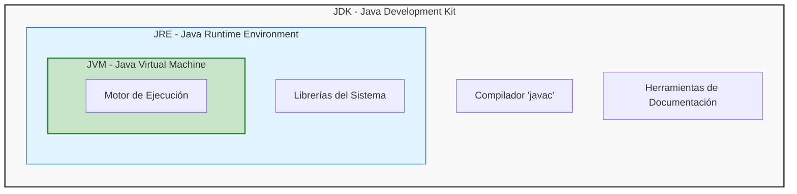
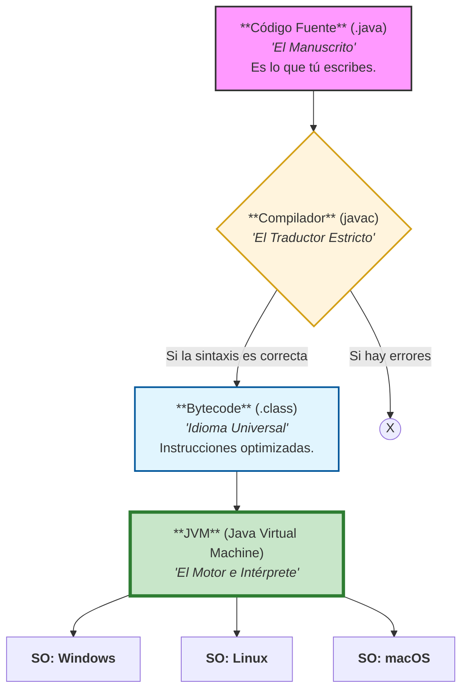
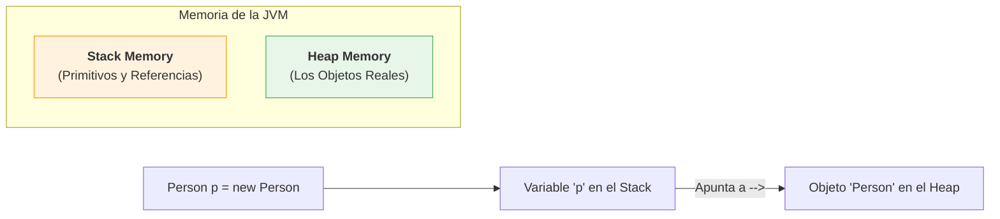
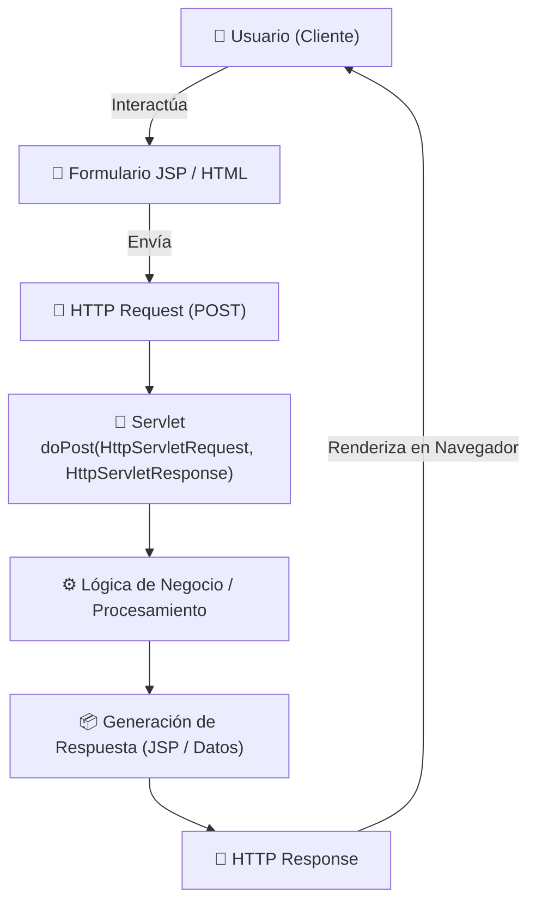

# JAVA - ☕

## 1. ¿Qué es Java realmente?

Java es un lenguaje de **alto nivel** y una **plataforma de ejecución**. Es el estándar en la industria bancaria y Fintech debido a su **robustez** y **seguridad** No solo escribes código, construyes sistemas que corren en un entorno controlado.

Sus pilares fundamentales:
- **Fuertemente Tipado y Verboso**: Java prioriza la claridad sobre la brevedad. Cada dato tiene un tipo definido `int balance`, lo que evita errores accidentales. **"Verbozo"** significa que el código se explica solo: es mejor `int accountBalance` que un `int b`.

- **Orientado a Objetos (POO)**: Organiza el código imitando conceptos del mundo real (Clientes, Cuentas, Transacciones), permitiendo crear sistemas complejos mediante modelos manejables.

- **Abstracción (El Enfoque)**: Java nos permite enfocarnos en "qué hace" un objeto en lugar de "cómo lo hace". Es la capacidad de simplificar problemas complejos del mundo real en modelos.
- **Multihilos (Multithreading)**: Capacidad nativa para realizar tareas en paralelo. Fundamental para que un servidor procese miles de pagos simultáneos sin colapsar.

- **Independiente del Hardware**: Gracias a su lema: *"Write once, run anywhere"* (Escríbelo una vez, ejecútalo en cualquier lugar). El código que haces en tu laptop funcionará exactamente igual en el servidor gigante del banco.

## 2. El Ecosistema: ¿Qué instalar?
Para trabajar en Java, debes conocer la diferencia entre estas herramientas:

| Siglas | Nombre | ¿Para qué sirve? |
|--------|--------|------------------|
| **JDK** | Java Delopment Kit | **Caja de herramientas del programador**. Contiene el compilador (`javac`) y lo necesario para crear software. |
| **JRE** | Java Runtime Eviroment | **Capa para el usuario**. Es el entorno necesario para que alguien pueda ejecutar tu programa ya terminado. |
| **JVM** | Java Virtual Machine | **El motor**. Es la pieza que traduce el código universal al lenguaje específico de tu PC. |

### Flujo del Ecosistema
Este diagrama muestra cómo el JDK contiene al JRE, y este a su vez protege al motor (JVM).



## 3. ¿Cómo funciona Java??
Java no corre directamente en tu procesador; corre dentro de una simulación segura llamada **JVM**. Esto crea una capa de seguridad (Sandbox) que protege a la computadora de errores del programa.


| Código Fuente | Compilador | Bytecode | JVM |
|---------------|------------|----------|-----|
| `.java` | `javac` | `.class` | Java Virtual Machine|
| **El Manuscrito** | **El traductor estricto** | **Idioma Universal** | **El intérprete y Motor** |
| Es lo que tú escribes con lógica humana. | Revisa tu archivo de arriba a abajo. Si hay un error de sintaxis, se detiene. | Instrucciones optimizadas que solo la JVM entiende. No es código máquina todavía. | El "simulador" que traduce el Bytecode a lenguaje real de tu procesador (Windows, Mac, Linux). |




## 4. Gestión de Memoria: Stack vs. Heap
Para entender la memoria, primero debemos saber que Java separa los Planos (Clases) de los Objetos Reales.

### Tabla comparativa de Memoria
| Característica | **Stack** (La Pila) | **Heap** (El Monton) |
|----------------|---------------------|----------------------|
| **¿Qué guarda?** | Variables locales y llamadas a métodos. | **Objetos** y variables de instancia. |
| **Orden** | LIFO (Last In First Out). Muy Organizado. | Desordenado. Los objetos se guardan donde haya espacio. |
| **Ciclo de Vida** | Vive solo mientras el método se ejecuta. | Vive mientras el objeto sea necesario |
| **Velocidad** | Extremadamente rápido | Más lento (requiere gestión del Garbage Collector) |

### JVM MEMORIA


### 4.1 Stack (Pila): Tareas Rápidas
Imagina una pila de platos. EL último que pones es el primero que quitas (**LIFO**).

- **¿Qué guarda?** Variables locales (las que viven dentro de un método) y las "direcciones" (referencias) de los objetos.

- **Velocidad**: Es extremadamente veloz.

- **Ciclo de vida**: Tan pronto el método termina, la memoria se limpia automáticamente. Es memoria de "corto plazo".

### 4.2 Heap - Monton: El Gran almacén
Imagina un almacen gigante y un poco desordenado donde guardas los productos terminados.

- **¿Qué guarda?** Los **Objetos Reales** (los productos que creaste con tus moldes).

- **Ciclo de vida**: Vive mientras alguien lo esté usando. Es memoria de "largo plazo".

### 4.3 ¿Cómo interactúan?
Este es el concepto clave:

1. **La referencia (En el Stack)**: Cuando escribes `Person person1`, estas creando un pequeño espacio en el **Stack** llamado `person1`. Es la "etiqueta" o el control remoto. Es como tener la dirección de un casa anotada en un papel.

2. **El Objeto (En el Heap)**: Al escribir `new Person()`, la JVM busca espacio en el Heap y construye el objeto físico.
    >⚠️ Ojo: Si el dato es un **Primitivo** (como `int age = 10`), el valor se guarda directamente en el Stack, ocupando el mínimo espacio y siendo ultra rápido.

3. **El Vínculo**: El control remoto en tu mano (Stack) apunta al televisor que está en la sala (Heap). ¡Si pierdes el control remoto, el televisor sigue ahí, pero ya no puedes usarlo!



## 5. El recolector de basura (Garbage Collector)
Java tiene gestión automática de memoria. Esto sucede gracias al **Garbage Collector (GC)**, un proceso que vive en el **Heap**.

- **¿Qué hace?** Escanea el Heap buscando objetos que ya nadie usa (objetos a los que el Stack ya no apunta, es decir, objetos que perdieron su "control remoto").

- **¿Por qué es importante?** En lenguajes antiguos como C++, tú tenías que limpiar la memoria manualmente. Si se te olvidaba, tu programa "explotaba". En Java, el Garbage Collector pasa la escoba por ti.


## 6. Programación Orientada a Objetos (POO): Moldes y Productos

Para que Java funcione, debemos dejar de pensar en líneas de código y empezar a pensar en arquitectura.
### 6.1 El concepto de Clase (`Class`) - El Molde

Es la unidad básica. Java es Verboso y Abstracto, por lo que todo debe estar dentro de un molde. La clase define:

Atributos: Los datos (ej. `double saldo`).

Comportamientos: Los métodos o acciones (ej. `void retirar()`).

### 6.2 El concepto de Objeto - La Instancia
Es el producto real que ocupa espacio en la memoria (Heap). Es cuando el molde se vuelve "real" y contiene datos específicos (ej. "La cuenta de Juan con $500").


## 7. Tipos de Datos: Los "Ladrillos" de Java
Como ya entendemos que el Stack es para cosas rápidas y el Heap es para objetos complejos, ahora debemos conocer con qué materiales vamos a construir. En Java existen dos grandes familias:

### 7.1 Tipos Primitivos (Viven 100% en el Stack)
Son los tipos de datos más básicos. No son objetos, no tienen métodos, solo son valores puros. Son extremadamente rápidos. Java tiene 8, pero en Fintech usaremos principalmente estos 4:

| Tipo | Tamaño | ¿Para qué se usa en un Banco? | Ejemplo |
|------|--------|-------------------------------|---------|
| `int` | 32 bits | Números enteros (IDs de usuario, contadores).| `int userId = 1024` |
| `double` | 64 bits | Números con decimales (Tasas de interés, porcentajes). | `double interestRate = 5.5` |
| `boolean` | 1 bit | Estados binarios (¿Está activa la cuenta? ¿Es fraude?). | `boolean isAccountActive = true`  |
| `long` | 64 bits | Números enteros muy grandes (Saldos en centavos, timestamps). | `long transactionId = 9876543210L` |

### 7.2 Tipos de Referencia (Viven en el Heap)
Son objetos. El más famoso es el String (cadenas de texto). A diferencia de los primitivos, estos pueden ser `null`(estar vacíos) y tienen métodos (acciones).

- Ejemplo: `String customerName = "Joshua Arnao"`;

- Aquí, `customerNam` es la referencia en el Stack y `"Joshua Arnao"` es el objeto en el Heap.

## 8. Punto de partida: public static void main
Todo progrma en Java necesita un lugar por donde empezar. Sin esta línea, la JVM no sabe que "hilo" jalar para inciar el proceso.
```java
public static void main(String[] args) {
    // Aquí empieza la magia
}
```

### ¿Qué significa cada palabra


## L.1 ¿Qué es un **Servlet**??
- Es una "Clase" especial de **Java** que se utiliza como punto intermedio entre una página **JSP** y el **servidor web** donde está alojada la lógica de una aplicación

- Un **servlet** se encaga de recibir **peticiones o request** desde un *cliente*, tratarlas y analizar si es necesario realizar anula solicitud en particular o brindar una determinada **respuesta o response**.

- Para poder tratar cada una dwe las peticiones utiliza una serie de mpetodos donde dependiendo del verbo por el cual ser reciba la petición (GET, POST, PUT, DELETE, etc)

### Métods de un servelete
Los ***servelets** tienen diferentes métidos que puede ser utilizado dependiento del tipo de solicitud que reciban por parte del cliente. Los dos más usado son:

- **doGet()**: Es el método encargado de recibir las solicitudes que provienen mediante GET.

- **doPost()**: Es el método encargado de recibir solicitudes que provienne mendaiante el POST.



### Pasar datos a un Servlet con getParameter()
El metodo **getParametr()** es una función importante en los **servlets** de **Java** que se utiliza para enviar datos desde un formulario HTML o para recuperar los parámetros de una solicitud HTTP GET en un servlet.

Estee método permite que los servlets accedan a la información proporcionada por el cliente a través de una solicitud HTTP

```java
String name = request.getParameter("txtNombre");
```

> El método `getParameter()` siempre devuelve un `String`

### ¿Qué son las sesiones?
una sesión HTTP es un espacio de memoria en el servidor asociado a un usuario especifico. El servidor identifica a cada cliente mediante una ID única de sesión y le permite guardar y/o leer datos a lo lardo de múltiples peticiones(reuqest).
En Java EE este mecanismoa esta implementado mediante la interfaz javx.`serverlet.http.HttpSession` y cada vez que el servidor necesita guardar datos para un usuario, crea un objeto HTTP SESSION.

### ¿Cómo se identifica una sesión?
El servidor genera un identificador único llamado: JSESSIONID. Este ID normalmente se envía al cliente en una cookie. Por ejemplo:
`Set-Cookie: JSESSIONID=AEF2348CC12F; Path=/; HttpOnly`

A partir de esto, en cada request siguiente, el navegador lo enviará automáticamente:
`Cookie: JSESSIONID=AEF2348CC12F`

Por otro lado, si el cliente tiene cookies desactivadas, el servidor puede usar URL rewriting, agregando el ID al final de la URL:
`http://miweb.com/tienda;jsessionid=AEF2348CC12F`

### ¿Qué son las cookies?
Son pequeños archivos de texto que el servidor envía al navegador del usuario y que éste almacena localmente. Su función principal es **recordar información entre vistas o peticiones**, permitiendo que el sitio mantenga cierto estado o preferencias del usuario.

Cada cookie esta compuesta por un **nombre**, un **valor** y opcionalmente atributos como tiempo de expiración, path, dominio y banderas de seguridad (HttpOnly o Secure).


### ¿Cómo se crea una sesión en Java Enterprice Edition?
Para crear una sesión en Java EE debemos dirigirnos a alguno de los servlets donde queramos trabajar con la sesión y crearla de la sigueinte manera
`HttpSession session = request.getSession();`

Por otro lado, si queremos obtner una sesión ya existente (en caso de que exita) sin la necesidad de crear una nueva, podemos hacerlo mendiante:
`HttpSession session = request.getSession();`

### ¿Cómo guardar y obtener atributos de una sesión?
Para guardar atributos o datos en una sesión, vamos a utilizar el método `setAttribute` de la siguiente manera:
```java
session.setAttribute("usuario", "Suscribite TodoCode");
session.setAttribute("rol", "ADMIN");
```

Como primer parámetro siempre va el `<<name>>` que queremos ponerle al atributo dentro de la sesión como segundo el `<<valor>>` asignado

Por otro lado para leer los atributos se utilzia el método `getAttribute` de la siguiente manera:

```java
String usuario = (String) session.getAttribute("usuario");
String rol = (String) session.getAttribute("rol");
```

Es imporantante siempre `<<castear>>`el tipo de dato que vamos a recibir e indiacar el **nombre** del atributo que queremos buscar.

Finalemnte tambien es posible eliminar atributos de las sesiones. Para esto, se utiliza el método removeAttribute de la siguiente manera:
`session.removeAttribute("usuario");`

### Usar sesiones y a y sus atributos desde JSP
La ventaka de las sesiones y duardar atributos en ellas es que podemos utilizar los últimos mencionados en cualquier apartado o JSP que tengamso en la aplicación siempre y cuando la sesión se mantenga activa.

Obtener el atributo usuario que esta en la sesión:
```java
<%
    String usuario = (String) session.getAttribute("usuario");
%>
```


## ¿Que es Java Persistence API?
JPA es un ORM(Object Relational Mapping) que tien como objetivo lograr la persistencia de datos entre una aplicación desarrollada en JAva y una base de datos.
JPA busca **traducir el modelo de las clases Java** a **un modeloado relacional en una base de datos**, posibilitando al pogramdor elegir quee clases u objetos quiere persistir.

### ¿Qué en un ORM?
Es una herramienta que:
-> Convierte objetos de Java
en
-> tablas de base de datos
Y vicerversa

Es como un conjunto de reglas que dicen:
- Cómo mapear objetos a tablas
- Cómo guardar datos
- Cómo hacer consultas
- Cómo manejar relaciones

Pero JPA no hace el trabajo directamente.

### Como funciona JPA
JPA se vale de una serie de paeos que se deben realizar sobre cada uno de los elementos de una clase, los mims se reepresentan mendainte annotations (@).

JPA cuenta con proveedores de JPA, entre ellos: Eclipselink, Hibernate, Toplink entre otros