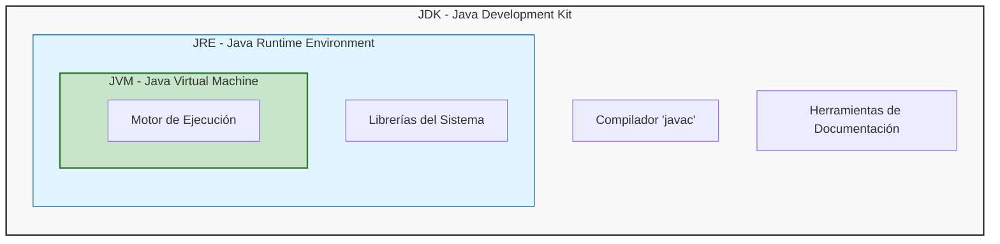
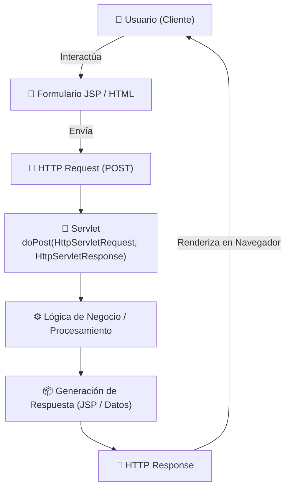
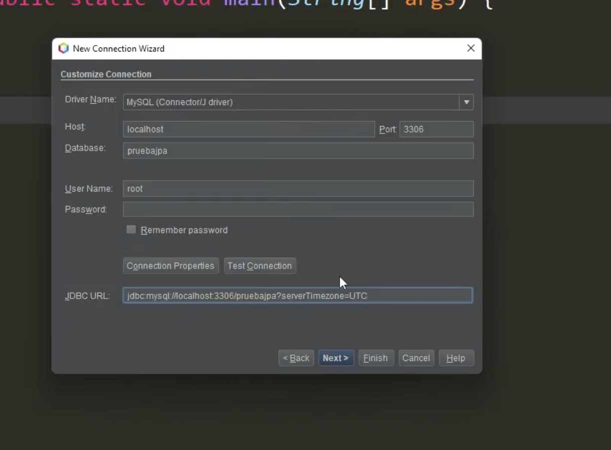

# JAVA - ☕

## 1. ¿Qué es Java realmente?

Java es un lenguaje de **alto nivel** y una **plataforma de ejecución**. Es el estándar en la industria bancaria y Fintech debido a su **robustez** y **seguridad** No solo escribes código, construyes sistemas que corren en un entorno controlado.

Sus pilares fundamentales:
- **Fuertemente Tipado**: Java prioriza la claridad sobre la brevedad. Cada dato tiene un tipo definido `int balance`, Esto evita errores de desbordamiento o tipos incompatibles en cálculos críticos.

- **"Verboso"** significa que el código se explica solo: es mejor `int accountBalance` que un `int b`.

- **Orientado a Objetos (POO)**: Organiza el código imitando conceptos del mundo real (Clientes, Cuentas, Transacciones), permitiendo crear sistemas complejos mediante modelos manejables.

- **Abstracción (El Enfoque)**: Java nos permite enfocarnos en "qué hace" un objeto en lugar de "cómo lo hace". Es la capacidad de simplificar problemas complejos del mundo real en modelos.

- **Multihilos (Multithreading)**: Capacidad nativa para realizar tareas en paralelo. Fundamental para que un servidor procese miles de pagos simultáneos sin colapsar.

- **Independiente del Hardware**: Gracias a su lema: *"Write once, run anywhere"* (Escríbelo una vez, ejecútalo en cualquier lugar). El código que haces en tu laptop funcionará exactamente igual en el servidor gigante del banco.

## 2. El Ecosistema: ¿Qué instalar?
Para trabajar en Java, debes conocer la diferencia entre estas herramientas:

| Siglas | Nombre | ¿Para qué sirve? |
|--------|--------|------------------|
| **JDK** | Java Delopment Kit | **Caja de herramientas**. Contiene el compilador (`javac`), herramientas de documentación y el JRE. Es lo que instala el programador |
| **JRE** | Java Runtime Eviroment | **Entorno de Ejecución**. Es el paquete mínimo necesario para que un usuario final pueda correr una aplicación Java. |
| **JVM** | Java Virtual Machine | **El motor de la ejecución**. Traduce el código universal (Bytecode) a instrucciones que el procesador de la computadora (Intel, Apple, AMD) entiende. |

### Diagrama de Jerarquía del Ecosistema
Este diagrama muestra cómo el JDK contiene al JRE, y este a su vez protege al motor (JVM).



## 3. Flujo de Ejecución y Seguridad - Sandbox
Java no corre directamente sobre el hardware. Se ejecuta dentro de una **JVM**, lo que crea un entorno seguro o **Sandbox**, protegiendo al sistema operativo de código malicioso o errores graves.


| Fase | Componente | Resultado | Descripción |
|------|------------|-----------|-------------|
| **Escritura** | Código Fuente  | `.java` | El archivo de texto con lógica humana. |
| **Compilación** | `.javac`  | `.class` | El "Traductor Estricto" genera Bytecode (instrucciones optimizadas). |
| **Interpretación** | **JVM** | Ejecución | El motor traduce el Bytecode a lenguaje máquina en tiempo real. |


## 4. Gestión de Memoria: Stack vs. Heap
Entender la memoria es la diferencia entre un programa eficiente y uno que colapsa un servidor bancario

- **Stack (Pila)**: Tareas Rápidas
  - **Función**: Memoria de acceso ultra rápido y corto plazo.

  - **Qué guarda**: Variables locales (primitivos como int, double) y las referencias (direcciones) a los objetos.

  - **Orden**: LIFO (Last In, First Out). Cuando un método termina, su Stack se limpia instantáneamente

- **Heap (Monton)**: El Gran almacén
  - **Función**: Memoria de largo plazo y gran capacidad.

  - **Qué guarda**: Los Objetos Reales (instancias de clases).

  - **Gestión**: Aquí vive el Garbage Collector (GC), que limpia automáticamente los objetos que ya no tienen una referencia en el Stack.

### 4.2 ¿Cómo interactúan?
Este es el concepto clave:

1. **La referencia (En el Stack)**: Cuando escribes `Person person1`, estas creando un pequeño espacio en el **Stack** llamado `person1`. Es la "etiqueta" o el control remoto. Es como tener la dirección de un casa anotada en un papel.

2. **El Objeto (En el Heap)**: Al escribir `new Person()`, la JVM busca espacio en el Heap y construye el objeto físico.
    >⚠️ Ojo: Si el dato es un **Primitivo** (como `int age = 10`), el valor se guarda directamente en el Stack, ocupando el mínimo espacio y siendo ultra rápido.

3. **El Vínculo**: El control remoto en tu mano (Stack) apunta al televisor que está en la sala (Heap). ¡Si pierdes el control remoto, el televisor sigue ahí, pero ya no puedes usarlo!


## 5. El recolector de basura (Garbage Collector)
Java tiene gestión automática de memoria. Esto sucede gracias al **Garbage Collector (GC)**, un proceso que vive en el **Heap**.

- **¿Qué hace?** Escanea el Heap buscando objetos que ya nadie usa (objetos a los que el Stack ya no apunta, es decir, objetos que perdieron su "control remoto").

- **¿Por qué es importante?** En lenguajes antiguos como C++, tú tenías que limpiar la memoria manualmente. Si se te olvidaba, tu programa "explotaba". En Java, el Garbage Collector pasa la escoba por ti.

## 6. Tipos de Datos y la Regla de Oro Financiera
Java divide los datos según cómo se guardan en memoria:

### 6.1 Tipos Primitivos (Viven en el Stack)
Son valores puros, no son objetos y son extremadamente rápidos.

- `int`: Enteros de 32 bits (IDs, contadores).
- `long`: Enteros de 64 bits (IDs grandes, timestamps).
- `boolean`: Valores lógicos (`true/false`).

  > **⚠️ ALERTA FINTECH**: Nunca uses `double` o `float` para saldos de dinero. Debido a cómo los procesadores manejan la coma flotante, pueden ocurrir errores de redondeo como `0.1 + 0.2 = 0.30000000000000004`. En su lugar, usamos la clase `BigDecimal`.

### 6.2 Tipos de Referencia (Viven en el Heap)
Son objetos complejos. El más común es `String`. Pueden ser `null`, lo que significa que la referencia en el Stack no apunta a ningún objeto en el Heap.

## 7. Arrays: La Primera Estructura de Datos
Antes de usar contenedores avanzados, debemos entender el Array.

**Definición**: Un Array es una colección de elementos del mismo tipo con un **tamaño fijo** definido al momento de su creación.

- **¿Por qué existen?** Para agrupar datos relacionados (ej. las últimas 10 transacciones) de forma contigua en memoria, lo que los hace muy rápidos para lectura.

- **Limitación**: Si creas un array de 5 espacios, no puedes añadir un sexto. Para eso necesitamos el *Collections Framework*.

## 8. El Punto de Entrada: `public static void main`
Todo progrma en Java necesita un lugar por donde empezar. Sin esta línea, la JVM no sabe que "hilo" jalar para inciar el proceso.
```java
public static void main(String[] args) {
    // Código inicial aquí
}
```

- `public`: Acceso total para que la JVM pueda ejecutarlo.

- `static`: El método le pertenece a la clase. La JVM no necesita crear un objeto para empezar a correr el programa.

- `void`: No devuelve ningún valor tras finalizar.

- `String[] args`: Un Array de textos que permite pasar configuración al programa desde la consola

## 9. Anatomía de una Clase y Modificadores
Antes de crear lógica bancaria, debemos entender cómo se estructura un método y quién tiene permiso de entrar a él. Un método es una acción que el objeto puede realizar.

### Estructura de un método:
`[Modificador de Acceso] [Modificador de Estado] [Tipo de Retorno] [Nombre]([Parámetros])`

- **Tipo de Retorno**: Puede ser un primitivo (`int`), un objeto (`String`,` Account`) o `void` si no devuelve nada.

- **Parámetros**: La información que el método necesita para trabajar (ej. `double price`).

### Los 4 Modificadores de Acceso
En banca, el acceso a los datos es crítico. Java usa estos niveles para decidir quién ve qué:

| Modificador | Clase | Paquete | Subclase (Heredero) | Mundo (Externo) | Uso en Banca |
|-------------|-------|--------|-------------|--------------|------------|
| `public` | Sí | Sí | Sí | Sí | Para servicios que cualquiera puede usar (ej. `consultarTipoDeCambio`) |
| `protected` | Sí | Sí | Sí | No | **Vital para JPA**. Permite que clases hijas usen el dato, pero nadie más de fuera. |
| `default` (No se escribe) | Sí | Sí | No | No | Llamado *Package-Private*. Solo los que están en la misma "oficina" (paquete) lo ven. |
| `private` | Sí | No | No | No | **Regla de oro**. Los saldos y claves siempre deben ser privados. |


## 10. Los 4 Pilares de la POO (Programación Orientada a Objetos)
Si la Clase es el molde y el Objeto es el producto, estos pilares son las reglas de ingeniería para que tu software sea profesional y seguro.

1. **Encapsulamiento**: Proteger los datos sensibles. Los atributos se marcan como `private` y se accede a ellos mediante métodos `public` (Getters/Setters) que validan la información.

2. **Abstracción**: Simplificar la realidad. Definimos qué hace un sistema (ej. `procesarPago()`) sin obligar al usuario a entender la complejidad interna.

3. **Herencia**: Reutilizar lógica. Una `CuentaAhorro` hereda las propiedades de una `CuentaBancaria`.

4. **Polimorfismo**: Un mismo comando, distintos comportamientos. El método `calcularComision()` actuará diferente si el objeto es una "Cuenta VIP" o una "Cuenta Estándar".

### 11. Interfaces vs. Clases Abstractas: El Contrato Bancario
En el nivel experto, no solo heredas código, sino que firmas **contratos de comportamiento**.

### 11.1 La Clase Abstracta (`abstract class`)
Es un "híbrido". Es un molde que no puede ser un producto final (no puedes hacer `new` de ella), pero tiene partes ya construidas.

- **Cuándo usarla**: Cuando tienes una base común. Ejemplo: Una `AccountBank` genérica tiene la lógica de "ver saldo", pero el "cobrar comisión" es diferente para cada una.

- En JPA: Se usan para crear "Entidades Base" que tienen campos comunes como `id` o `fecha_creacion`.

### 11.2 La Interfaz (`interface`)
Es un contrato puro. No dice cómo se hacen las cosas, solo qué cosas se deben poder hacer.

En Fintech: Son fundamentales. Definimos una interfaz `PaymentProcessor`. Luego, podemos tener una implementación para `Visa` y otra para `Stripe`. El sistema principal no sabe cuál usa, solo sabe que ambas cumplen el contrato.

| Característica | Clase Abstracta | Interfaz |
|----------------|-----------------|----------|
| **Herencia** | Una clase solo puede heredar de UNA. | Una clase puede implementar MUCHAS interfaces. |
| **Atributos** | Puede tener variables normales (estado). | Solo constantes (`public static final`). |
| **Métodos** | Puede tener métodos con código y sin código. | Principalmente métodos sin código (hasta Java 8). |

## 12. Java Collections Frameworks
Cuando los Arrays se quedan cortos por su tamaño fijo, usamos Colecciones: contenedores dinámicos que crecen según la necesidad.

- `List` (**ArrayList**): Como un Array, pero dinámico. Permite duplicados y mantiene el orden de inserción.

- `Set` (**HashSet**): No permite duplicados. Ideal para listas de IDs únicos.

- `Map` (**HashMap**): Almacena pares Llave : Valor (ej. "DNI" : "Nombre de Usuario"). Es el buscador más rápido del lenguaje.

## 13. Anotaciones (@Metadata): Etiquetas Inteligentes
Las anotaciones son etiquetas que pegamos en el código para darle instrucciones al compilador o a un Framework (como JPA o Spring). No cambian la lógica del código, pero le dicen a Java: "Oye, este objeto tiene un tratamiento especial".

¿Por qué existen?
Antiguamente, para configurar un sistema bancario, tenías archivos XML gigantes de miles de líneas. Las anotaciones permiten configurar el sistema dentro del mismo código.

Las que verás en JPA:
1. `@Entity`: Le dice a Java: "Esta clase no es solo un molde, es una tabla en la base de datos".

2. `@Table(name = "usuarios")`: Especifica el nombre exacto de la tabla.

3. `@Id`: Indica que esa variable es la "Llave Primaria" (el identificador único en el banco).

4. `@Column`: Define reglas para esa columna (ej. `nullable = false` para que el campo no sea nulo).

    **Analogía**: Imagina que envías una caja por correo. El contenido es el código, pero las etiquetas de "FRÁGIL" o "ESTE LADO HACIA ARRIBA" son las anotaciones. No son el contenido, pero le dicen al transportista (JPA/Hibernate) cómo manejar la caja.

## 14. Generics: El "Contenedor Etiquetado"
Antes de que existieran los Genéricos (en versiones antiguas de Java), las colecciones eran como **bolsas negras de basura**. Podías meter cualquier cosa dentro (un número, un texto, un objeto). El problema era al sacar las cosas: no sabías qué eran y tenías que "adivinar" (hacer un Casting), lo que causaba que el programa explotara en plena ejecución.

### La Analogía: La Caja de Seguridad vs. La Bolsa de Misterio
- **Sin Genéricos (Bolsa de Misterio)**: Metes un fajo de billetes. Al sacarlo, Java te dice: "Aquí tienes un Objeto". Tú tienes que rezar y decir: "Confío en que esto sea un Billete". Si te equivocas, el sistema colapsa.

- **Con Genéricos (Caja Etiquetada)**: Creas una caja que dice `Caja<Billete>`. Java no te permitirá meter una moneda ni un contrato ahí dentro. Y al sacarlo, Java ya sabe que es un Billete. Seguridad total.

### ¿Por qué son tan potentes?
| Beneficio | Explicación |
|-----------|-------------|
| Seguridad en Compilación | El "Traductor Estricto" (`javac`) detecta el error antes de que el programa corra. |
| Adiós al Casting | No tienes que escribir (`Account`) myAccount cada vez que sacas algo de una lista. |
| Reutilización de Código | Puedes escribir una lógica (ej. un procesador de envíos) que funcione para cualquier tipo de dato. |

### Anatomía de un Genérico
Verás letras como `<T>`, `<E>` o `<K, V>`. No es código secreto, son "Placeholders" (espacios reservados).

- `<T>`: Significa Type (Tipo). Se usa cuando una clase puede manejar cualquier tipo.
- `<E>`: Significa Element (Elemento). Muy usado en listas.
- `<K, V>`: Key (Llave) y Value (Valor). Se usa en los Mapas.

## 14. ¿Qué es una Excepción?
En Java, una **Excepción** es un evento inesperado que ocurre durante la ejecución de un programa y que interrumpe el flujo normal de las instrucciones.

### La Anatomía del Try-Catch-Finally
Java nos da una estructura para "atrapar" estos errores antes de que maten al programa.

```java
try {
    // 1. EL INTENTO: Aquí pones el código "peligroso"
    // (Ejemplo: Conectar al banco o dividir por cero)
    int result = 100 / 0; 
} 
catch (ArithmeticException e) {
    // 2. EL PLAN DE EMERGENCIA: Se ejecuta solo si algo falló en el 'try'
    System.out.println("Error: No puedes dividir por cero, genio.");
} 
finally {
    // 3. EL CIERRE: Se ejecuta SIEMPRE, haya error o no.
    // (Ideal para cerrar conexiones a bases de datos)
    System.out.println("Limpiando recursos...");
}
```

### La Jerarquía: No todos los errores son iguales
Para ser un profesional, debes saber que Java organiza los errores en una familia:

- `Error`: Son fallos catastróficos de la **JVM** (ej. se acabó la memoria RAM del servidor). **No puedes atraparlos**; si esto pasa, el programa muere.
- `Exception`: **Estos son los que tú debes manejar**. Se dividen en dos:

#### Tabla: Checked vs. Unchecked Exceptions

| Tipo | Nombre | ¿Cuándo ocurre? | ¿Es obligatorio manejarla? | Ejemplo |
|------|--------|-----------------|----------------------------|---------|
| **Checked** | Verificadas | Errores externos (Bases de datos, Archivos). | **SÍ**. El compilador no te deja avanzar si no pones un `try-catch`. | `SQLException, IOException` |
| **Unchecked** | No verificadas | Errores de lógica del programador. | **NO**. Pero deberías evitarlas con buena lógica. | `NullPointerException, ArithmeticException` |

### Propagación de Errores: El `throws`
A veces, un método no quiere hacerse cargo del error y prefiere "pasarle la bola" al que lo llamó. Esto se hace con la palabra clave `throws`.


## L.1 ¿Qué es un **Servlet**??
- Es una "Clase" especial de **Java** que se utiliza como punto intermedio entre una página **JSP** y el **servidor web** donde está alojada la lógica de una aplicación

- Un **servlet** se encaga de recibir **peticiones o request** desde un *cliente*, tratarlas y analizar si es necesario realizar anula solicitud en particular o brindar una determinada **respuesta o response**.

- Para poder tratar cada una dwe las peticiones utiliza una serie de mpetodos donde dependiendo del verbo por el cual ser reciba la petición (GET, POST, PUT, DELETE, etc)

### Métods de un servelete
Los ***servelets** tienen diferentes métidos que puede ser utilizado dependiento del tipo de solicitud que reciban por parte del cliente. Los dos más usado son:

- **doGet()**: Es el método encargado de recibir las solicitudes que provienen mediante GET.

- **doPost()**: Es el método encargado de recibir solicitudes que provienne mendaiante el POST.



### Pasar datos a un Servlet con getParameter()
El metodo **getParametr()** es una función importante en los **servlets** de **Java** que se utiliza para enviar datos desde un formulario HTML o para recuperar los parámetros de una solicitud HTTP GET en un servlet.

Estee método permite que los servlets accedan a la información proporcionada por el cliente a través de una solicitud HTTP

```java
String name = request.getParameter("txtNombre");
```

> El método `getParameter()` siempre devuelve un `String`

### ¿Qué son las sesiones?
una sesión HTTP es un espacio de memoria en el servidor asociado a un usuario especifico. El servidor identifica a cada cliente mediante una ID única de sesión y le permite guardar y/o leer datos a lo lardo de múltiples peticiones(reuqest).
En Java EE este mecanismoa esta implementado mediante la interfaz javx.`serverlet.http.HttpSession` y cada vez que el servidor necesita guardar datos para un usuario, crea un objeto HTTP SESSION.

### ¿Cómo se identifica una sesión?
El servidor genera un identificador único llamado: JSESSIONID. Este ID normalmente se envía al cliente en una cookie. Por ejemplo:
`Set-Cookie: JSESSIONID=AEF2348CC12F; Path=/; HttpOnly`

A partir de esto, en cada request siguiente, el navegador lo enviará automáticamente:
`Cookie: JSESSIONID=AEF2348CC12F`

Por otro lado, si el cliente tiene cookies desactivadas, el servidor puede usar URL rewriting, agregando el ID al final de la URL:
`http://miweb.com/tienda;jsessionid=AEF2348CC12F`

### ¿Qué son las cookies?
Son pequeños archivos de texto que el servidor envía al navegador del usuario y que éste almacena localmente. Su función principal es **recordar información entre vistas o peticiones**, permitiendo que el sitio mantenga cierto estado o preferencias del usuario.

Cada cookie esta compuesta por un **nombre**, un **valor** y opcionalmente atributos como tiempo de expiración, path, dominio y banderas de seguridad (HttpOnly o Secure).


### ¿Cómo se crea una sesión en Java Enterprice Edition?
Para crear una sesión en Java EE debemos dirigirnos a alguno de los servlets donde queramos trabajar con la sesión y crearla de la sigueinte manera
`HttpSession session = request.getSession();`

Por otro lado, si queremos obtner una sesión ya existente (en caso de que exita) sin la necesidad de crear una nueva, podemos hacerlo mendiante:
`HttpSession session = request.getSession();`

### ¿Cómo guardar y obtener atributos de una sesión?
Para guardar atributos o datos en una sesión, vamos a utilizar el método `setAttribute` de la siguiente manera:
```java
session.setAttribute("usuario", "Suscribite TodoCode");
session.setAttribute("rol", "ADMIN");
```

Como primer parámetro siempre va el `<<name>>` que queremos ponerle al atributo dentro de la sesión como segundo el `<<valor>>` asignado

Por otro lado para leer los atributos se utilzia el método `getAttribute` de la siguiente manera:

```java
String usuario = (String) session.getAttribute("usuario");
String rol = (String) session.getAttribute("rol");
```

Es imporantante siempre `<<castear>>`el tipo de dato que vamos a recibir e indiacar el **nombre** del atributo que queremos buscar.

Finalemnte tambien es posible eliminar atributos de las sesiones. Para esto, se utiliza el método removeAttribute de la siguiente manera:
`session.removeAttribute("usuario");`

### Usar sesiones y a y sus atributos desde JSP
La ventaka de las sesiones y duardar atributos en ellas es que podemos utilizar los últimos mencionados en cualquier apartado o JSP que tengamso en la aplicación siempre y cuando la sesión se mantenga activa.

Obtener el atributo usuario que esta en la sesión:
```java
<%
    String usuario = (String) session.getAttribute("usuario");
%>
```


## ¿Que es Java Persistence API?
JPA es un ORM(Object Relational Mapping) que tien como objetivo lograr la persistencia de datos entre una aplicación desarrollada en JAva y una base de datos.
JPA busca **traducir el modelo de las clases Java** a **un modeloado relacional en una base de datos**, posibilitando al pogramador elegir quee clases u objetos quiere persistir.

### ¿Qué en un ORM?
Es una herramienta que:
-> Convierte objetos de Java
en
-> tablas de base de datos
Y vicerversa

Es como un conjunto de reglas que dicen:
- Cómo mapear objetos a tablas
- Cómo guardar datos
- Cómo hacer consultas
- Cómo manejar relaciones

Pero JPA no hace el trabajo directamente.

### Como funciona JPA
JPA se vale de una serie de paeos que se deben realizar sobre cada uno de los elementos de una clase, los mims se reepresentan mendainte **annotations** (`@`).

JPA cuenta con proveedores de JPA, entre ellos: Eclipselink, Hibernate, Toplink entre otros



### Annotations más usadas
- `@Entity`: Especifica la creación de una entidad. Se coloca al incio de la definciión de una clase.

- `@Id`: Primary key de la entidad
    - `GeneratedValue(strategy=GenerationType.SEQUENCE)`: Establece que la ID se va a generar de forma automática y secuencial.

- `@Basic`: Para hacer referencia a atributos comunes.

- `@Temporal`: Se usa normalmente en fechas.
    - Si se quiere tener en cuenta la hora se utiliza: `@Temporal(TemporalType.TIMESTAMP)`
    - Si solo se tiene en cuenta la fecha (DATE): `@Temporal(TemporalType.DATE)`

- `@OneToMany`: Indicar una relación unidireccional de 1 a n.

- `@OneToOne`: Indicar una relación de 1 a 1.

- `@ManyToMany`: Indicar una relación de n a n.

luego del mapeo de entidades se debe de reflejar el mapeo en la unidad de persistencia

### JPA Controllers
